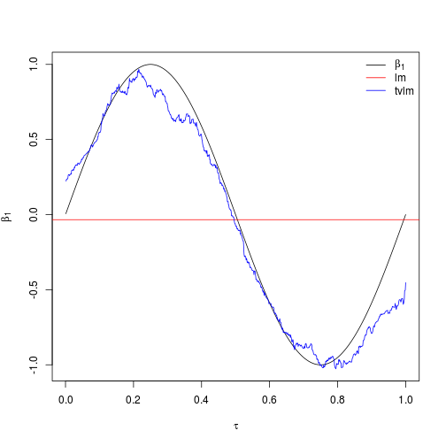

# Statistical background

In comparison to parametric models, the appeal of nonparametric models is their flexibility and robustness to functional form misspecification. However, they are not very convinient when many regressors are in play as their rate of convergence decreases as the number of regressors increases, the infamous ''curse of dimensionality". An interesting compromise arise with semiparametric models which are linear in the variables, but whose parameters change over time. A simple example is an univariate time-varying coefficients linear model give by,

\begin{equation}
y_t =  X_t^T \beta_t + \epsilon_t, \ \ t= 1, \ldots, T
\label{eq:tvlm}
\end{equation} 

where $y_t$ and $\epsilon_t$ are scalars, $X_t = (x_{1t}, x_{2t}, \ldots, x_{dt})^T$ is a vector of regressors at time $t$ and $\beta_t$ is a vector of coefficients depending on a variable changing over time. Semiparametric methods such as model (\ref{eq:tvlm}) are typical alternatives, still maintaining a great level of flexibility and a good rate of convergence. Time-varying coefficients may be defined as unknown functions of time as $\beta_t= f(t/T)$, or an unknown function of a random variable $z_t$ as $\beta_t=f(z_t)$. The former was firstly introduced in @Robinson1989 for stationary processes and generalized to nonstationary processes and correlated errors by @ChangMartinezChombo2003 and @Cai2007 amongst others. Recently, @Chenetal2017 apply it to the HAR model for the realized volatility of S\&P 500 index returns. It is a very flexible approach but its forecast is not consistent because there is no information from the dependent variable at time $T+1$. The latter has been studied for stationary or iid $\{(X_t, z_t, \epsilon_t)\}$ processes by @HastieTibshirani1993 and @Caietal2000, and the particular case of autoregressive processes by @ChenTsay1993. Nonstationary processes, either due to nonstationarity in the regressors or the dependent variable $z_t$,  have been studied by @ChangMartinezChombo2003 and @Caietal2006 while @Das2005 and @Hendersonetal2015 have used it for instrumental variables and SUR frameworks respectively.

The coefficients are estimated using the local polynomial kernel smoothing in cite{FanGijbel1996}. The most common methods are the local constant(LC) or Nadaraya-Watson method and the local linear (LC). Roughly explained, these methodologies fit a set of weighted local regressions where the size of the windows is optimally chosen automatically. The length of these windows is given by the bandwidth $h$ and the weights are given by the kernel $K_h(\cdot)$.

The necessary assumptions for convergence is that function $f(\cdot)$ is sufficiently smooth, one derivative for the LC and two derivatives for the LL. The kernel function must have a 


# Source code


The source code of the *tvReg* package is publicly available
for download from the Comprehensive *R* Archive Network (CRAN,
\url{http://CRAN.R-project.org/}).
The four basic functions in this package are *tvLM*, *tvAR*, *tvSURE* and *tvVAR*. Moreover, this package provides
tools for graphical display of the results, extract results and fitted values, calculate bandwidths and obtain the time-varying OLS and time-varying GLS estimators.

## The basic function *tvLM*

The *tvLM* function estimates the time varying coefficients of a multiple regression using the time-varying OLS method in function *tvOLS*. The returned object of this function is an object of class *tvlm*.


### Standard usage of *tvLM*

As described in the previous section, a time-varying coefficients linear model can be
econometrically estimated with function *tvLM* which wraps the estimator *tvOLS* and the bandwidth calculation *bw*, when necessary. The only mandatory argument is *formula* which should be a single formula for a single equation model. This formula follows the standard regression formula in *R* (see documentation of *formula*).

The following examples demostrates the functionality of *tvLM* on generated data, and compares with the results from *lm*. The data generating process of the example below has time-varying coefficients and therefore its estimation with function *lm* will only find the average value over time.

We want to estimate the following model :
$$
y_t  = \beta_{1}(\tau) X_{1t}+ \beta_{2} (\tau) X_{2t} + u_t, \ \ t = 1, \ldots, T, \ \ \tau = t/T
$$
where the coefficients are function of a scaled time variable $\tau$.


```r
library("tvReg")
## Data simulation
tau <- seq(1:1000)/1000
beta <- data.frame(beta1 = sin(2 * pi * tau), beta2 = 2 * tau)
X1 <- rnorm(1000)
X2 <- rchisq(1000, df = 4)
error <- rt(1000, df = 10)
y <- apply(cbind(X1, X2) * beta, 1, sum) + error
data <- data.frame(y = y, X1 = X1, X2 = X2)

## Estimate coefficients with lm and tvLM for comparison

coef.lm <- stats::lm(y ~ 0 + X1 + X2, data = data)$coef
coef.tvlm <- tvLM(y ~ 0 + X1 + X2, data = data)$tvcoef

## Comparing results in a plot
plot(tau, beta[, 1], type = "l", main = "", ylab = expression(beta[1]), xlab = expression(tau), 
    ylim = range(beta[, 1], coef.tvlm[, 1]))
abline(h = coef.lm[1], col = 2)
lines(tau, coef.tvlm[, 1], col = 4)
legend("topright", c(expression(beta[1]), "lm", "tvlm"), col = c(1, 2, 4), bty = "n", 
    lty = 1)
```




--------
tvCov<-function(x, bw, est="lc", tkernel="Epa")
--------

### Independent series


```r
library(MASS)
## Generate two independent (uncorrelated) series
y <- cbind(rnorm(200, sd = 4), rnorm(200, sd = 1))
## Calculate the bandwidth
bw.cov <- bwCov(y)
## Estimate variance-variance matrix
Sigma.hat <- tvCov(y, bw = bw.cov)
## The first time point estimate
print(Sigma.hat[, , 1])
```

```
##            [,1]      [,2]
## [1,] 16.7559177 0.3367603
## [2,]  0.3367603 0.9332759
```

```r
## The mean over time of all estimates
print(apply(Sigma.hat, 1:2, mean))
```

```
##            [,1]      [,2]
## [1,] 16.7549745 0.3365849
## [2,]  0.3365849 0.9333054
```

### Dependent series


```r
## Generate two dependent variables with a covariance of -0.5
y <- mvrnorm(n = 200, mu = c(0, 0), Sigma = cbind(c(1, -0.5), c(-0.5, 4)))
## Calculate the bandwidth
bw.cov <- bwCov(y)
## Estimation the variables variance-covariance matrix
Sigma.hat <- tvCov(y, bw = bw.cov)
## The first time point estimate
print(Sigma.hat[, , 1])
```

```
##            [,1]       [,2]
## [1,]  0.9939580 -0.3862581
## [2,] -0.3862581  3.7492716
```


